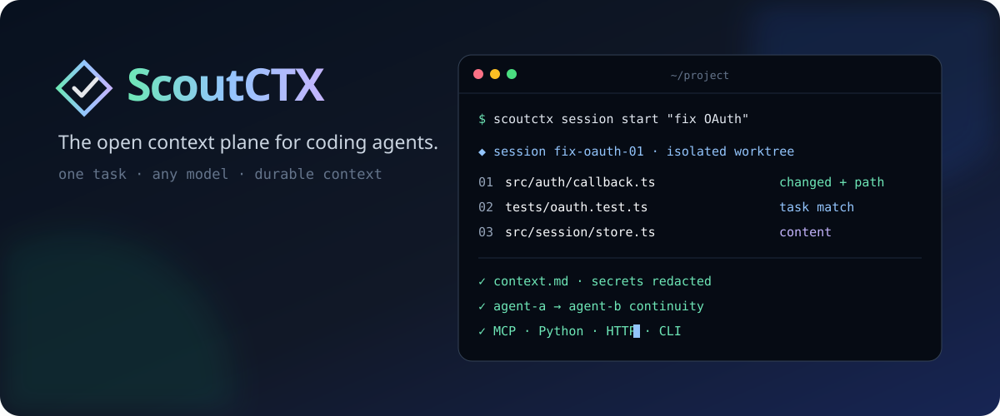

<div align="center">
  

  <p><strong>One task. Any model. Context that survives the switch.</strong></p>

  <p>
    <a href="https://github.com/mnabid05/scoutctx/actions/workflows/ci.yml"></a>
    <a href="LICENSE"></a>
    
    
  </p>
</div>

ScoutCTX is an open-source context and session framework for coding agents. It
turns a task, a repository, Git state, team knowledge, and durable notes into a
small context package that any model or harness can consume.

It does **not** call a model. It gives models the right context through a Python
API, CLI, local HTTP endpoint, or MCP tools.

```bash
# Create an isolated task session and Git worktree.
scoutctx session start "replace polling with event delivery"

# Run any installed agent with the generated context.
scoutctx session run replace-polling-with-event-delivery-01 -- \
  my-agent --context-file '{context}'

# Add a handoff fact, then continue with another model or harness.
scoutctx session note replace-polling-with-event-delivery-01 \
  "Keep the public events import path stable."
scoutctx session run replace-polling-with-event-delivery-01 -- \
  another-agent --context-file '{context}'
```

The worktree, task, notes, harness history, and regenerated repository context
belong to the session—not to the first model that touched it.

## Why people build on it

- **Model-neutral:** plain Markdown/JSON plus CLI, Python, HTTP, and MCP surfaces.
- **Session-native:** deterministic task IDs, shared notes, archiveable state,
  and optional Git worktrees for concurrent agents.
- **Context-provider API:** add architecture decisions, ownership, runbooks, or
  internal docs without coupling the core to a catalog vendor.
- **Transparent retrieval:** lexical scores explain path, content, Git, and
  project-anchor signals; no opaque index is required.
- **Budget-aware:** large files become relevant line windows instead of eating
  the entire model window.
- **Safe baseline:** redaction on by default, bounded reads, binary filtering,
  symlink exclusion, root-confined servers, and no shell-based harness launch.
- **Small enough to audit:** Python 3.11+, standard library only at runtime.

## Install

```bash
pipx install git+https://github.com/mnabid05/scoutctx.git
# or
uv tool install git+https://github.com/mnabid05/scoutctx.git
```

## Three ways to use ScoutCTX

### 1. Build context now

```bash
cd your-project
scoutctx build "fix the flaky OAuth callback tests" \
  --budget 6000 \
  --output context.md
```

The original shorthand still works:

```bash
scoutctx "trace duplicate webhook delivery" --format json --output context.json
```

### 2. Keep a portable agent session

```bash
scoutctx session start "add cancellation to the import worker"
scoutctx session list
scoutctx session context add-cancellation-to-the-import-worker-01 --budget 6000
scoutctx session run --dry-run add-cancellation-to-the-import-worker-01 -- \
  local-agent --prompt '{context}'
scoutctx session archive add-cancellation-to-the-import-worker-01
```

By default a Git-backed session creates branch `scoutctx/<session-id>` and a
linked worktree under `.scoutctx/worktrees/`. Pass `--no-worktree` for a
read-only/non-Git workflow. See [the session guide](docs/sessions.md).

### 3. Connect a model or orchestration framework

Python:

```python
from scoutctx import ScoutCTX

scout = ScoutCTX("/path/to/repository", budget=6_000)
context = scout.context("repair token refresh")

answer = model.generate(
    task="repair token refresh",
    repository_context=context.content,
)
```

MCP client configuration:

```json
{
  "mcpServers": {
    "scoutctx": {
      "command": "scoutctx",
      "args": ["mcp", "--root", "/path/to/repository"]
    }
  }
}
```

The MCP server exposes:

- `scout_context` for a fresh task-focused package; and
- `scout_session_context` for a persistent session with notes and harness
  continuity.

For language-independent integrations:

```bash
scoutctx serve --root /path/to/repository --host 127.0.0.1 --port 8765

curl --fail-with-body http://127.0.0.1:8765/v1/context \
  -H 'Content-Type: application/json' \
  -d '{"task":"trace duplicate webhook delivery","budget":5000}'
```

The development HTTP server has no authentication or TLS and should stay on
loopback. Both adapters confine requested roots beneath the root configured by
their launcher.

See [integration recipes](docs/integrations.md) for LangGraph, custom model
SDKs, providers, MCP, and HTTP.

## Add organizational context

Applications can register deterministic providers for architecture decisions,
ownership, team docs, or policies:

```python
from scoutctx import ScoutCTX
from scoutctx.providers import DirectoryProvider, ProviderRegistry

providers = ProviderRegistry({
    "decisions": DirectoryProvider(
        "docs/decisions",
        globs=("**/*.md",),
        source="architecture",
        weight=10,
    )
})

scout = ScoutCTX("/path/to/repository", providers=providers)
result = scout.context("change the refresh-token policy")
```

Provider failures are isolated. Documents are deterministically ordered,
bounded, excerpted, and redacted before they join the repository context.

## How it fits together

```text
repository + Git + task + notes + provider documents
                         |
             scan -> rank -> excerpt -> redact
                         |
             ContextResult (Markdown or JSON)
                /          |          \
             Python       HTTP        MCP
                \          |          /
                   any model or harness
                            |
                    session worktree
```

The model-free core owns selection. Transports stay thin, and harnesses keep
their own credentials, permission model, tool loop, and provider SDK. Read the
[architecture guide](docs/xirp-style-architecture.md) for the implemented
boundaries and honest roadmap.

## Configuration

`scoutctx init` creates `.scoutctx.toml`:

```toml
[scoutctx]
budget = 12000
max_file_bytes = 262144
max_files = 24
redact = true

include = []
exclude = ["*.min.js", "*.map", "coverage/**", "fixtures/**"]
```

Use `.scoutctxignore` for project filters. CLI include/exclude flags extend the
configured lists. The local `.scoutctx/` session store is excluded from scans
by default so a generated snapshot never feeds itself back into the next one.

## Security model

Repository and provider text is untrusted data. ScoutCTX labels it accordingly,
but redaction is a safety net rather than a proof that context is safe to share.
Review outbound packages for sensitive projects. A launched harness runs with
your OS permissions; a Git worktree isolates files and indexes, not processes.

See [SECURITY.md](SECURITY.md) for reporting and trust boundaries.

## Development

```bash
git clone https://github.com/mnabid05/scoutctx.git
cd scoutctx
python -m pip install -e .
PYTHONPATH=src python -m unittest discover -s tests -v
PYTHONPATH=src python -m scoutctx "improve ranking" --budget 1000
```

Every behavior change needs a standard-library `unittest`. Runtime dependency
count stays at zero. See [CONTRIBUTING.md](CONTRIBUTING.md).

## Roadmap

- named harness profiles and plugin discovery;
- reviewed transcript-to-knowledge workflows;
- remote workers and durable run events;
- team synchronization, access control, and encrypted stores; and
- catalog, issue tracker, ownership, and documentation connectors.

The local context/session contract is implemented today; hosted collaboration
features are not. If this is the missing context layer in your agent stack,
star it and bring a provider or harness adapter.

## License

[MIT](LICENSE) © ScoutCTX contributors
